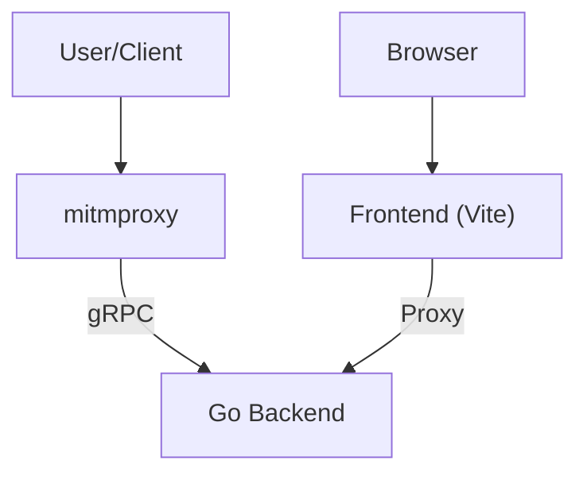
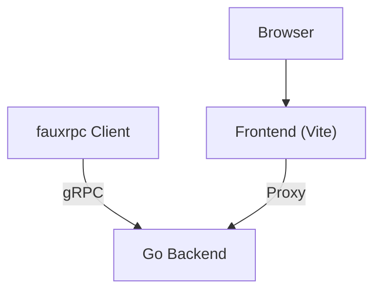
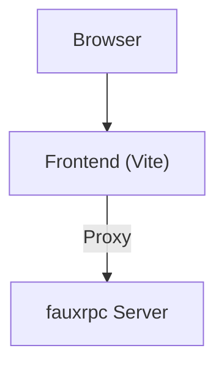

# mitmflow

`mitmflow` is a tool for inspecting and analyzing network traffic. It consists of a `mitmproxy` addon that captures traffic and a web interface for viewing and analyzing it.

## Features

*   **Real-time traffic inspection:** View HTTP, DNS, TCP, and UDP flows in real-time.
*   **Detailed flow analysis:** Inspect flow details, including headers, bodies, and connection information.
*   **Extensible:** The `mitmproxy` addon can be customized to support additional protocols and features.

## Getting Started

### Prerequisites

*   [mitmproxy](https://mitmproxy.org/)
*   [Go](https://golang.org/)
*   [pnpm](https://pnpm.io/)
*   [mise](https://mise.jdx.dev/)

### Installation

1.  **Install the `mitmproxy` addon:**

    ```bash
    pip install mitmproxy-addon-grpc
    ```

2.  **Install the web interface dependencies:**

    ```bash
    pnpm install
    ```

### Running mitmflow

1.  **Start the `mitmflow` server:**

    ```bash
    go run .
    ```

2.  **Start the `mitmproxy` addon:**

    ```bash
    mitmproxy -s extra_addons.py --set grpc_addr=http://127.0.0.1:50051 --set grpc_events=all
    ```

    You can customize the gRPC server address and the event types to emit using the `grpc_addr` and `grpc_events` options. For example, to connect to a different gRPC server and only emit `request` and `response` events, you would use the following command:

    ```bash
    mitmproxy -s extra_addons.py --set grpc_addr=http://localhost:50052 --set grpc_events=request,response
    ```

3.  **Start the web interface:**

    ```bash
    pnpm dev
    ```

### Using Docker Compose

You can also run the full stack (mitmflow + mitmproxy) using Docker Compose.

1.  **Create a `docker-compose.yml` file:**

    ```yaml
    services:
      mitmflow:
        image: ghcr.io/sudorandom/mitmflow:latest
        ports:
          - "50051:50051"
          - "80:50051"
        environment:
          - MAX_FLOWS=1000

      mitmproxy:
        image: mitmproxy/mitmproxy:latest
        user: root
        command: >
          bash -c "pip install mitmproxy-addon-grpc && mitmdump --set grpc_addr=http://mitmflow:50051 --set grpc_events=all -s extra_addons.py"
        volumes:
          - ./extra_addons.py:/app/extra_addons.py:ro
        working_dir: /app
        ports:
          - "8080:8080"
        depends_on:
          - mitmflow
    ```

2.  **Start the services:**

    ```bash
    docker-compose up
    ```

3.  **Access the web interface:**
    Open [http://localhost](http://localhost) or [http://localhost:50051](http://localhost:50051) in your browser.

4.  **Configure your proxy:**
    Configure your browser or device to use the proxy at `http://localhost:8080`.

## Developer Guide

### Mise
All tooling is installed using [mise-en-place](https://mise.jdx.dev). This is a tool for installing specific versions of tools. This is used for tooling for Python, Go and Typescript and some other tooling like buf.

### Development Scenarios

There are three main ways to run and test the application, depending on your development needs.

#### Scenario 1: Full System (Real Traffic)
This is the most realistic scenario, involving the real `mitmproxy` instance, the real Go backend, and the real frontend.



1.  **Start the App (Backend & Frontend):**
    ```bash
    just dev
    ```
2.  **Start mitmproxy:**
    ```bash
    mitmproxy -s extra_addons.py --set grpc_addr=http://127.0.0.1:50051 --set grpc_events=all
    ```

#### Scenario 2: Backend Development (FauxRPC Client)
This scenario uses a `fauxrpc` client to send simulated traffic to the real Go backend. Useful for testing backend logic without generating real traffic.



1.  **Start the App (Backend & Frontend):**
    ```bash
    just dev
    ```
2.  **Generate Traffic:**
    ```bash
    just fauxrpc-client
    ```

#### Scenario 3: Frontend Development (FauxRPC Server)
This scenario uses a `fauxrpc` server to mock the backend. Useful for frontend development without running the Go backend or `mitmproxy`.



1.  **Start Mocked App:**
    ```bash
    just dev-fauxrpc
    ```
