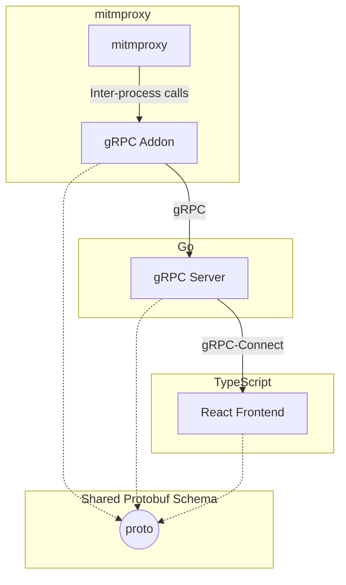

# mitmflow

`mitmflow` is a tool for inspecting and analyzing network traffic. It consists of a `mitmproxy` addon that captures traffic and a web interface for viewing and analyzing it.

## Features

`mitmflow` provides several features beyond the standard `mitmproxy` web UI:

*   **gRPC-Web Support:** Parse and inspect gRPC-Web frames using `protoscope`.
*   **HAR File Exports:** Export flows to HAR files for analysis in other tools.
*   **JSON Exports:** Export all flow types to JSON for easy integration with other systems.
*   **Read-only UI:** The UI is read-only, preventing accidental modification of traffic and making it safe for "consume only" environments.
*   **Real-time traffic inspection:** View HTTP, DNS, TCP, and UDP flows in real-time.
*   **Detailed flow analysis:** Inspect flow details, including headers, bodies, and connection information.
*   **Extensible:** The `mitmproxy` addon can be customized to support additional protocols and features.

## Architecture


```mermaid
graph TD
    subgraph mitmproxy
        A[mitmproxy]
        B[gRPC Addon]
    end
    subgraph Go
        C[gRPC Server]
    end
    subgraph TypeScript
        D[React Frontend]
    end

    A -- Inter-process calls --> B
    B -- gRPC --> C
    C -- gRPC-Connect --> D

    subgraph "Shared Protobuf Schema"
        E((proto))
    end

    B -.-> E
    C -.-> E
    D -.-> E
```

## Getting Started

### Prerequisites

*   [mitmproxy](https://mitmproxy.org/)
*   [Go](https://golang.org/)
*   [pnpm](https://pnpm.io/)
*   [mise](https://mise.jdx.dev/)

### Installation

1.  **Install the `mitmproxy` addon:**

    ```bash
    pip install .
    ```

2.  **Install the web interface dependencies:**

    ```bash
    pnpm install
    ```

### Running mitmflow

1.  **Start the `mitmflow` server:**

    ```bash
    go run .
    ```

2.  **Start the `mitmproxy` addon:**

    ```bash
    mitmweb -s grpc_addon.py --set grpc_addr=http://127.0.0.1:50051 --set grpc_events=all
    ```

    You can customize the gRPC server address and the event types to emit using the `grpc_addr` and `grpc_events` options. For example, to connect to a different gRPC server and only emit `request` and `response` events, you would use the following command:

    ```bash
    mitmweb -s grpc_addon.py --set grpc_addr=http://localhost:50052 --set grpc_events=request,response
    ```

3.  **Start the web interface:**

    ```bash
    pnpm dev
    ```

## Developer Guide

### Using `fauxrpc` for frontend development

For frontend development, you can use `fauxrpc` to test the web interface without running the `mitmflow` server.

1.  **Start `fauxrpc`:**

    ```bash
    just fauxrpc
    ```

2.  **Start the web interface:**

    ```bash
    pnpm dev
    ```